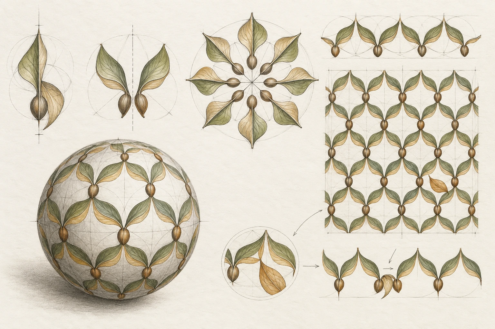
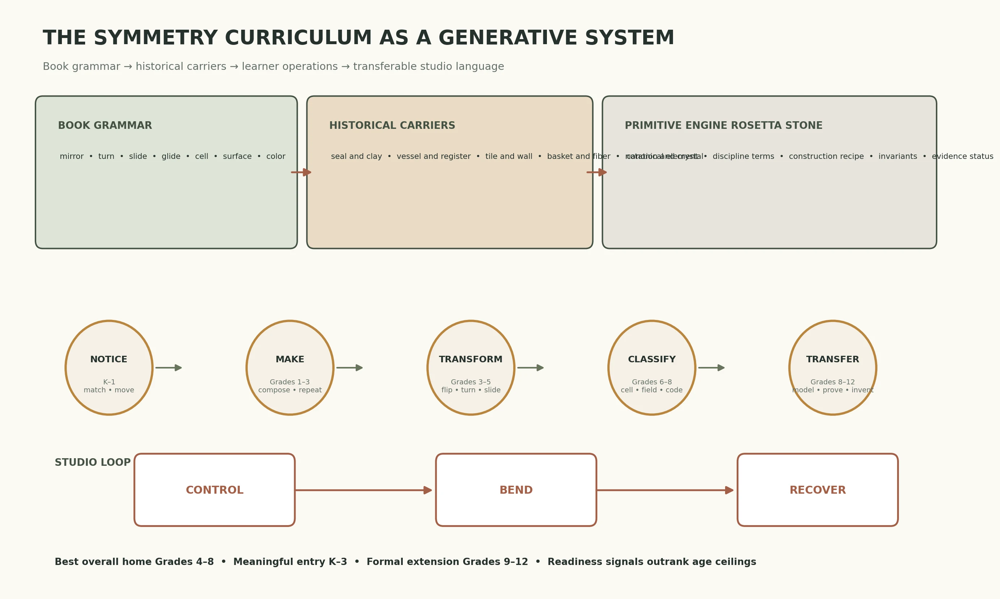
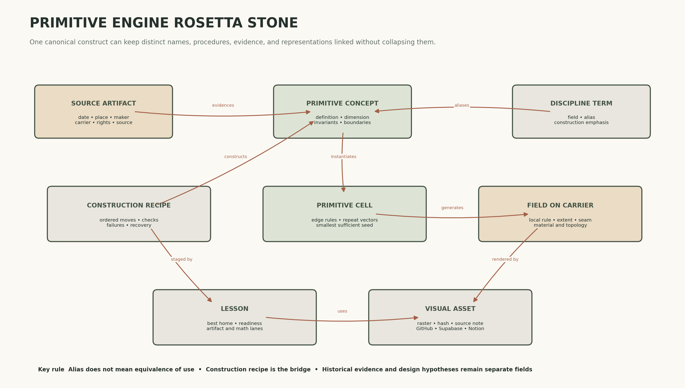
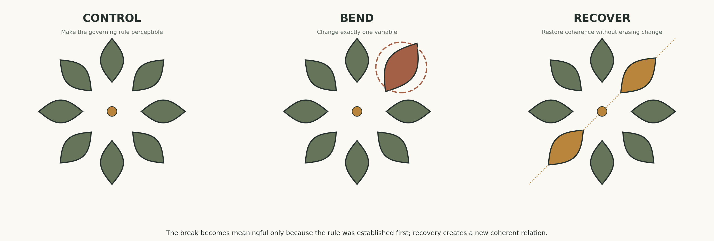

# The Symmetries of Things Curriculum Study

> Learning to Drawu · K–8 core with Grades 9–12 extensions · 19 September 2026

## Plumage

Symmetry is not sameness. It is a promise between parts: a line that remembers its partner, a center that gathers a turn, a path that carries a motif forward, a field that grows from a seed, and a surface that changes the rule as it bends. Learners should see, move, make, break, and recover the rule before formal language compresses it.

## Curriculum verdict

- **Best overall home:** Grades 4–8.
- **Meaningful entry:** K–3 through perception, movement, folding, stamping, composition, and verbal rule description.
- **Formal extension:** Grades 9–12 through functions, matrices, groups, orbifolds, topology, proof, and code.
- **Spine:** primitive → motif → transformation → fundamental region → field → carrier → color rule → deliberate defect → explanation.
- **Placement:** readiness signals outrank age ceilings.

## Evidence lanes

| Lane | Use | Guardrail |
|---|---|---|
| Historical reality | Attributed objects, materials, documented functions, source rights | Resemblance does not prove meaning or transmission |
| Developmental evidence | Research and standards on recognition, parameterization, construction, and formalization | Grade bands are best homes, not ceilings |
| Pedagogical hypothesis | Proposed lessons, studio prompts, and cross-disciplinary translations | Test in classroom practice |

## Book grammar

| Principle | Curriculum translation | Studio test |
|---|---|---|
| Transformation creates kinship | Teach what is preserved before naming the operation. | Copy one seed three ways and mark the distances, angles, or orientation that stay invariant. |
| The seed can be smaller than the field | Move from finished ornament back to the smallest repeatable cause. | Crop candidate cells, test them at the edges, and keep only the cell that rebuilds the field. |
| Rule and ornament are different layers | Separate what the image depicts from how its parts relate. | Swap the motif while holding the transformation rule constant. |
| Local centers build global order | Name the organizing dimension before adding complexity. | Construct point, line, and plane families from the same motif. |
| The carrier changes possibility | Treat material and surface as active constraints rather than neutral backgrounds. | Repeat one cell on paper, around a cylinder, and over a sphere; record distortions. |
| Color is an operation | Assess color structure separately from shape structure. | Keep the geometry fixed while testing two-, three-, and four-color rules. |
| Classification can be finite | Classification is a late compression tool, not the first experience. | Sort anonymous patterns by observable operations, then compare with formal families. |
| A broken rule can focus attention | Use asymmetry as an authored decision, not as an error disguised after the fact. | Establish a repeat, alter one variable, then recover coherence elsewhere. |
| Notation is generative syntax | Treat notation as a recipe that can be executed and revised. | Exchange pattern codes with a partner who must reconstruct without seeing the original. |

## Historical progression

### ca. 2900–2700 BCE  Cylinder seal with chevrons and oblique lines

- **Historical reality:** Mesopotamia, Nippur. The seal served identification and ownership; rolling enabled a continuous design. Carrier: Carved limestone rolled through clay. Visible geometry: Translation, border rhythm, continuous impression.
- **Design hypothesis:** Use a clay or foam roller to discover repeat as a physical action rather than a worksheet pattern.
- **Boundary:** Do not infer sacred meaning from geometry alone.

### ca. 900–700 BCE  Painted vessels and funerary markers

- **Historical reality:** Geometric Greece. The period is associated with visual clarity and order; imagery also participated in social and funerary contexts. Carrier: Curved ceramic surface arranged in registers. Visible geometry: Meander, translation, alternation, radial neck and body bands.
- **Design hypothesis:** Treat the vessel profile as a changing bandwidth; vary repeat density as circumference changes.
- **Boundary:** Formal order does not by itself disclose iconographic meaning.

### 1262  Cross-and-eight-pointed-star tile panel

- **Historical reality:** Iran. The V&A identifies a repeatable cross-and-star arrangement in a dated Iranian panel. Carrier: Glazed ceramic architectural surface. Visible geometry: Interlocking cell, reflection, rotation, plane tessellation.
- **Design hypothesis:** Begin with the adjacency rule between two shapes, then extend the field beyond the page edge.
- **Boundary:** Teach the specific object and context; avoid reducing Islamic art to a generic pattern style.

### ca. 1815–1822  Coin basket attributed to Juana Basilia Sitmelelene

- **Historical reality:** Chumash, California. The object belongs to a named maker and a living Indigenous cultural history. Carrier: Coiled and woven plant fibers with dye. Visible geometry: Radial organization, concentric bands, rhythmic interval.
- **Design hypothesis:** Model radial growth with paper coils or cord while tracking interval changes from center to rim.
- **Boundary:** Do not copy culturally specific motifs as free-floating decoration; study structure with attribution.

### 19th century formalization  Group and space-group classification systems

- **Historical reality:** European mathematics and crystallography. Abstract group language and crystallographic classification made recurring transformation systems explicit. Carrier: Symbolic notation, diagrams, crystal models. Visible geometry: Operations composed into finite classification systems.
- **Design hypothesis:** Introduce classification after learners can produce and compare the operations themselves.
- **Boundary:** Formal naming is not the historical origin of patterned practice.

### late 19th–mid 20th century  Double Prestige Panel

- **Historical reality:** Kuba peoples, Central Africa. The Met describes a composition whose whole cannot be predicted from a single section. Carrier: Raffia and vegetable dye. Visible geometry: Interlocking rhythm with asymmetry and local variation.
- **Design hypothesis:** Use it as a critical counterexample: regularity may be bent while coherence survives.
- **Boundary:** Do not force the object into a Western symmetry taxonomy or treat irregularity as incompleteness.

### 20th century to present  Transformation prints, crystals, textiles, tilings, digital generative systems

- **Historical reality:** Art, design, science, and computation. The same operation vocabulary now circulates across disciplines with different names and goals. Carrier: Paper, architecture, screens, data, and simulated surfaces. Visible geometry: Color symmetry, topology, algorithms, higher-dimensional extensions.
- **Design hypothesis:** Use the Primitive Engine to translate vocabulary while retaining each field’s construction logic.
- **Boundary:** Shared geometry does not make cultural objects interchangeable.

## Primitive Engine Rosetta Stone

The Primitive Engine is a translation layer, not a synonym list. Each canonical concept links discipline-specific terms to an ordered construction recipe, preserved invariants, evidence status, and visual representations.

The machine-readable schema is in [`primitive-engine-rosetta-stone.schema.json`](primitive-engine-rosetta-stone.schema.json).

## Grade progression

| Grade | Emphasis | Activity | Readiness signal |
|---|---|---|---|
| K | Notice and move | Mirror a partner’s pose; sort same-shape cards in different orientations; press-and-fold paint. | Matches without depending on upright orientation; uses body words such as across, around, and same. |
| 1 | Pair and compose | Build bilateral creatures from cut shapes; make a two-motif turn stamp; complete half-images with tiles. | Places paired parts at comparable distances from an axis; distinguishes a flip from a simple move. |
| 2 | Repeat and partition | Stamp a frieze; bracket the smallest repeat; invent a two-color alternation; tessellate with squares and triangles. | Finds where a repeat begins again; keeps spacing consistent for at least four repetitions. |
| 3 | Describe the rule | Roll a seal in clay; create operation cards; compare strip patterns; connect tessellation to area. | Explains the action that generates the next copy; distinguishes motif, gap, and unit cell. |
| 4 | Construct reflection and rotation | Plot reflected points across an axis; construct four- and eight-fold rosettes; count axes; debug a near-symmetry. | Preserves perpendicular distance in reflection and radius in rotation; names more than one axis when present. |
| 5 | Coordinate cell, field, and color | Design a wallpaper cell; translate it in two directions; apply a color permutation; wrap it around a paper cylinder. | Separates spatial rule from color rule and predicts neighbors beyond the drawn field. |
| 6 | Infer hidden construction | Recover a lattice from a finished pattern; make a glide-reflection footprint border; map a net to a surface. | Locates likely centers, axes, and vectors; proposes and tests a smallest sufficient seed. |
| 7 | Model constraints and scale | Reconstruct a historical carrier at scale; compare cloth, tile, and vessel constraints; execute a partner’s recipe. | Uses measurements to reproduce a rule and identifies where material forces a change. |
| 8 | Sequence and justify transformations | Compose transformations on a coordinate plane; classify friezes; defend a unit cell; encode a pattern signature. | Justifies congruence through a transformation sequence and distinguishes evidence from interpretation. |
| 9–12 | Formalize and generalize | Generate a Cayley table; compare wallpaper groups; use Euler characteristic; write or code a pattern grammar. | Moves flexibly among image, equation, matrix, code, and proof while tracking invariants. |

## Lesson progression

### Lesson 1  Same through change

**Best home K–3 with formal return in Grade 8**

- **Book anchor:** Symmetry is introduced through the transformations that leave an object or pattern recognizably unchanged.
- **Historical or material anchor:** Use familiar objects and an unattributed original motif before historical comparison. The goal is to establish observation without importing meaning.
- **Day A:** Place one seed motif at several orientations. Learners circle copies that are still the same shape and state what changed and what did not. Add body motions for slide, flip, and turn.
- **Day B:** Trace one motif on transparent film. Execute one slide, one flip, and one turn. Overlay the copies and mark preserved lengths, angles, and orientation.
- **K–2:** Move, match, trace, and sort. Use spoken relational language rather than symbols.
- **Grades 3–5:** Record the operation with arrows, axes, and centers; distinguish change of position from change of shape.
- **Grades 6–8:** Treat each operation as a mapping of every point; test whether distance and angle are preserved.
- **Control → Bend → Recover:** Control: exact copy. Bend: stretch one copy so it is no longer rigid. Recover: redraw it using a legal slide, flip, or turn and explain the correction.
- **Assessment evidence:** The learner identifies an invariant instead of relying only on visual resemblance.

### Lesson 2  Mirror and pair

**Best home Grades 1–4**

- **Book anchor:** Mirror lines define kaleidoscopic organization and reveal that correspondence occurs across an axis.
- **Historical or material anchor:** Compare bilateral organization in bodies and leaves with one attributed woven or architectural example. Keep natural form and cultural design conceptually separate.
- **Day A:** Use a standing mirror, folding, and cut-paper silhouettes to test candidate axes. Ask whether a claimed axis works for every point, not just the outline.
- **Day B:** Build a motif on one side of a taped axis, then construct its partner by equal perpendicular offsets. Add line weight so the axis remains visible but subordinate.
- **K–2:** Fold-print and partner-pose activities with one vertical axis.
- **Grades 3–5:** Grid reflection across vertical, horizontal, and diagonal axes; count all valid axes.
- **Grades 6–8:** Reflect coordinates and explain why orientation reverses while lengths and angles remain fixed.
- **Control → Bend → Recover:** Control: exact bilateral pair. Bend: shift one landmark. Recover: choose whether to restore accuracy or echo the displacement on the other side as a new rule.
- **Assessment evidence:** Corresponding points sit at equal perpendicular distance from the axis.

### Lesson 3  Center and turn

**Best home Grades 2–5**

- **Book anchor:** Rosette patterns gather repeated motifs around a center through gyration or rotation.
- **Historical or material anchor:** Study the construction logic of rosettes and radial baskets without claiming identical cultural meanings. Name each object, maker, carrier, and source.
- **Day A:** Locate centers in flowers, wheels, rosettes, and basket structures. Count repeats and estimate the turn angle. Test by tracing and rotating a transparent wedge.
- **Day B:** Construct a wedge with one confident motif, rotate it by equal angles, and vary line weight toward or away from the center. Compare orders 3, 4, 6, and 8.
- **K–2:** Turn a stamp around a marked dot and count returns.
- **Grades 3–5:** Use angle fractions or a protractor; distinguish number of motifs from number of symmetry turns.
- **Grades 6–8:** Represent the rotation about a coordinate center and analyze which turns map the rosette to itself.
- **Control → Bend → Recover:** Control: equal radial intervals. Bend: enlarge one motif or interval. Recover: redistribute size or spacing so the center remains visually stable.
- **Assessment evidence:** The learner maintains a common center and approximately constant radius before adding detail.

### Lesson 4  Path and repeat

**Best home Grades 2–5**

- **Book anchor:** Frieze patterns add translation along one direction and may combine it with reflection, rotation, or glide reflection.
- **Historical or material anchor:** A Mesopotamian cylinder seal makes translation physical; Greek vessel bands show how a repeat negotiates a curved carrier.
- **Day A:** Roll a carved foam cylinder or textured tube through clay or ink. Mark one full revolution and identify where the pattern begins again. Compare with a hand-stamped strip.
- **Day B:** Design a border using a measured translation vector. Extend it across a strip, then around a paper cylinder. Record how seam placement affects continuity.
- **K–2:** Stamp and chant the repeat; bracket one complete rhythmic unit.
- **Grades 3–5:** Measure the translation vector and repair accumulated spacing drift.
- **Grades 6–8:** Classify the operations present in several friezes and construct counterexamples.
- **Control → Bend → Recover:** Control: regular interval. Bend: accelerate or decelerate spacing. Recover: establish a second rhythm that explains the change.
- **Assessment evidence:** The learner distinguishes the motif from the distance and direction of its repetition.

### Lesson 5  Slide flip and handedness

**Best home Grades 4–7**

- **Book anchor:** The mirrorless crossing called glide reflection combines a flip with movement along a line.
- **Historical or material anchor:** Footprints offer a culturally neutral embodied entry. Historical borders can then be analyzed for operation without assuming intent.
- **Day A:** Walk beside a taped line and map alternating footprints. Compare a translated pair, a reflected pair, and a glide-reflected pair. Discuss handedness.
- **Day B:** Build a two-row border whose motif changes orientation only through a glide. A partner reconstructs the border from the written recipe.
- **K–2:** Experience only through footsteps and handprints; do not require the formal term.
- **Grades 3–5:** Use arrows and a mirror line to describe the two-step move.
- **Grades 6–8:** Compose reflection and translation in coordinates; test whether reversing the order changes the result.
- **Control → Bend → Recover:** Control: exact alternation. Bend: place one footprint with the wrong handedness. Recover: diagnose whether the flip or the slide failed.
- **Assessment evidence:** The learner can state both component actions and track orientation.

### Lesson 6  Unit cell and field

**Best home Grades 4–8**

- **Book anchor:** Plane patterns are generated by translations in two independent directions; a fundamental region can rebuild the whole.
- **Historical or material anchor:** The dated Iranian cross-and-star panel demonstrates adjacency and tessellation on an architectural carrier. Teach it as a specific object, not a generic style.
- **Day A:** Overlay candidate cell boundaries on a pattern. Reject cells that fail at edges or require hidden information. Compare the motif, tile, and fundamental region.
- **Day B:** Create an original cell from two primitives and tile a field in two directions. Crop beyond the page edge so the field reads as potentially continuous.
- **K–2:** Fit repeating shapes without gaps using manipulatives.
- **Grades 3–5:** Mark one repeat block and predict missing neighbors.
- **Grades 6–8:** Identify independent translation vectors; compare a convenient tile with a minimal fundamental region.
- **Control → Bend → Recover:** Control: seamless field. Bend: alter one adjacency. Recover: redesign the cell boundary or propagate a compatible new rule.
- **Assessment evidence:** The learner can rebuild the field from a compact seed and explain edge matching.

### Lesson 7  Color rule and deliberate defect

**Best home Grades 5–8**

- **Book anchor:** Color symmetry shows that a spatial operation can preserve the arrangement while permuting colors.
- **Historical or material anchor:** Compare a regular color permutation with the Kuba Double Prestige Panel as a caution against treating perfect predictability as the only sophisticated outcome.
- **Day A:** Keep one geometry fixed and test several color cycles. Ask which operations preserve shape only and which preserve both shape and color.
- **Day B:** Establish a field, introduce one authored disruption, and make a second decision that lets the composition recover without simply erasing the difference.
- **K–2:** Alternate two colors and notice the exceptional tile.
- **Grades 3–5:** Track two independent rules: where the motif goes and how its color changes.
- **Grades 6–8:** Represent color permutation explicitly and critique when asymmetry feels intentional, structural, or accidental.
- **Control → Bend → Recover:** This lesson is the full Control → Bend → Recover cycle. Document the governing rule, the exact break, and the compensating recovery.
- **Assessment evidence:** The learner can name the violated variable and defend the recovery with visual evidence.

### Lesson 8  Wrap classify and encode

**Best home Grades 6–8 with Grades 9–12 extension**

- **Book anchor:** The book moves from plane and sphere patterns into surfaces, orbifolds, groups, tilings, and higher-dimensional generalization.
- **Historical or material anchor:** Use a ball, paper polyhedron, vessel, or modeled surface to show that the carrier changes spacing, adjacency, and possible global closure.
- **Day A:** Transfer a square grid to a cylinder and a sphere. Mark where lines converge, stretch, or require seams. Compare what is locally regular with what is globally possible.
- **Day B:** Classify a small set of learner-made rosettes, friezes, and fields by operations. Write a compact pattern code and exchange it for reconstruction.
- **K–2:** Wrap a strip around a tube and notice the seam; stop before formal classification.
- **Grades 3–5:** Compare flat, cylindrical, and spherical versions of the same motif field.
- **Grades 6–8:** Classify by transformations and defend the minimal seed; use informal signature notation.
- **Control → Bend → Recover:** Control: accurate local cell. Bend: wrap onto a curved carrier. Recover: adapt scale, spacing, or seam placement while preserving the chosen invariant.
- **Assessment evidence:** The learner distinguishes local appearance from global surface behavior and can execute a pattern from a code.

## System mapping

| System | Role |
|---|---|
| GitHub | Versioned curriculum canon, schema, images, and document |
| Supabase | Queryable concepts, aliases, recipes, relationships, and visual asset records |
| Notion | Human-readable curriculum record and project memory |
| ArtisanalCanvas | Interactive learner surface for decomposing and replaying construction |

## Sources

- [The Symmetries of Things official preview](https://api.pageplace.de/preview/DT0400.9781439864890_A26654802/preview-9781439864890_A26654802.pdf) — Book structure, terminology, and problem-first progression.
- [A Learning Progression for Geometric Transformations](https://files.eric.ed.gov/fulltext/EJ1238359.pdf) — Developmental sequence from visual recognition toward formal mapping and construction.
- [Common Core Mathematics Geometry Standards](https://www.thecorestandards.org/Math/Content/8/G/) — K–8 standards spine, especially line symmetry and rigid transformations.
- [Mesopotamian cylinder seal with geometric design](https://www.metmuseum.org/art/collection/search/325481) — Translation as a material action and continuous repeat on clay.
- [Geometric Art in Ancient Greece](https://www.metmuseum.org/essays/geometric-art-in-ancient-greece) — Vessel wrap, register, rhythm, clarity, and order.
- [Design and make your own Islamic tile and printed pattern](https://www.vam.ac.uk/articles/design-and-make-your-own-islamic-tile-and-printed-pattern) — Cross-and-star tiling, repeated fields, and age-accessible making.
- [Juana Basilia Sitmelelene coin basket](https://americanindian.si.edu/exhibitions/infinityofnations/california-greatbasin/230132.html) — Materially constrained radial and woven organization with cultural specificity.
- [Kuba Double Prestige Panel](https://www.metmuseum.org/art/collection/search/318398) — Irregular repetition and a necessary counterexample to symmetry as the only aesthetic endpoint.
- [International Tables for Crystallography plane group 17](https://it.iucr.org/Ac/ch2o2v0001/sgtable2o2o017/) — Authoritative plane-group reference and classification extension.

## Running project sum

This study extends the Geometry Art Through Human History curriculum and Primitive Cell Studio. Its new contribution is the explicit transformation spine and the Primitive Engine Rosetta Stone, which translates cross-disciplinary names through construction procedures and invariants. The next implementation milestone is a fully linked Reflection prototype spanning GitHub, Supabase, Notion, and ArtisanalCanvas.
